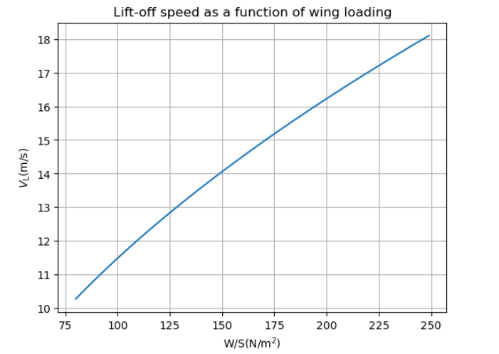
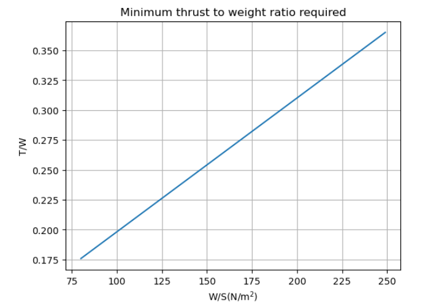
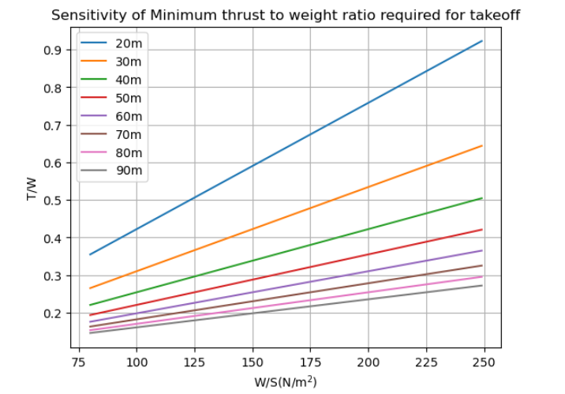
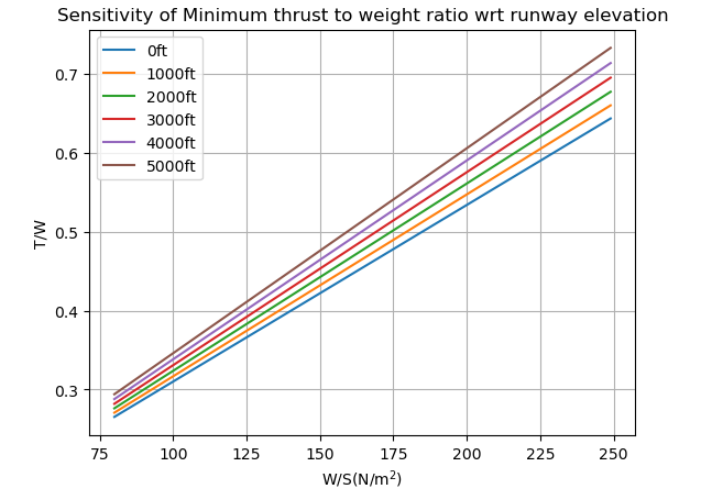
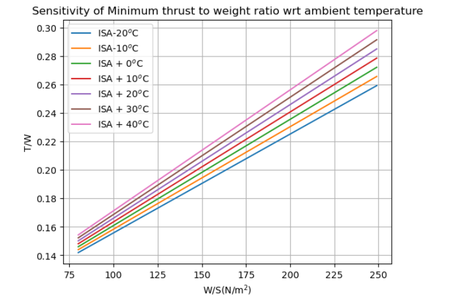
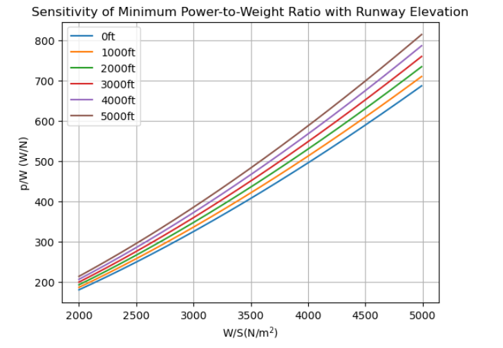
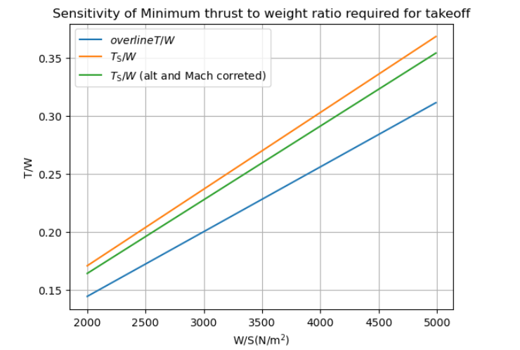

# Aircraft Take-Off Performance Analysis Using ADRpy

Aircraft take-off performance is one of the primary considerations during preliminary aircraft design.

This project uses ADRpy to perform sensitivity analyses on aircraft take-off performance by evaluating the influence of runway length, runway elevation, ambient temperature, wing loading, and propulsion parameters.

## Overview

This project investigates aircraft take-off performance using the ADRpy library in Python. The analysis evaluates the effects of runway length, runway elevation, ambient temperature, wing loading, and thrust-to-weight ratio on aircraft take-off performance through sensitivity studies.

---

## Project Highlights

- Python-based aircraft performance analysis
- ADRpy implementation for preliminary aircraft design
- Seven engineering performance plots
- Sensitivity analysis of runway and atmospheric conditions
- Wing loading and thrust-to-weight trade-off studies

## Objectives

* Analyze aircraft take-off performance under varying operating conditions.
* Evaluate the effect of wing loading on lift-off speed.
* Study the influence of runway length on thrust-to-weight requirements.
* Investigate the impact of runway elevation and ambient temperature on take-off performance.
* Perform power-to-weight and thrust correction analyses.

---

## Programming Language

* Python

---

## Development Environment

* Jupyter Notebook

---

## Libraries Used

* ADRpy
* NumPy
* Matplotlib

---

## Parameters Studied

* Wing Loading (W/S)
* Lift-Off Speed
* Runway Length
* Runway Elevation
* Ambient Temperature
* Thrust-to-Weight Ratio (T/W)
* Power-to-Weight Ratio (P/W)

---

## Results

### Lift-Off Speed vs Wing Loading

---

### Minimum Take-Off Thrust-to-Weight Ratio

---

### Runway Length Sensitivity

---

### Runway Elevation Sensitivity

---

### Ambient Temperature Sensitivity

---

### Power-to-Weight Ratio Sensitivity

---

### Thrust Correction Analysis

---

## Repository Contents

* Python source code
* Performance analysis plots
* Project documentation (README)

---

## Author

**Shruti Jaykumar Wani**

B.Tech Aerospace Engineering
